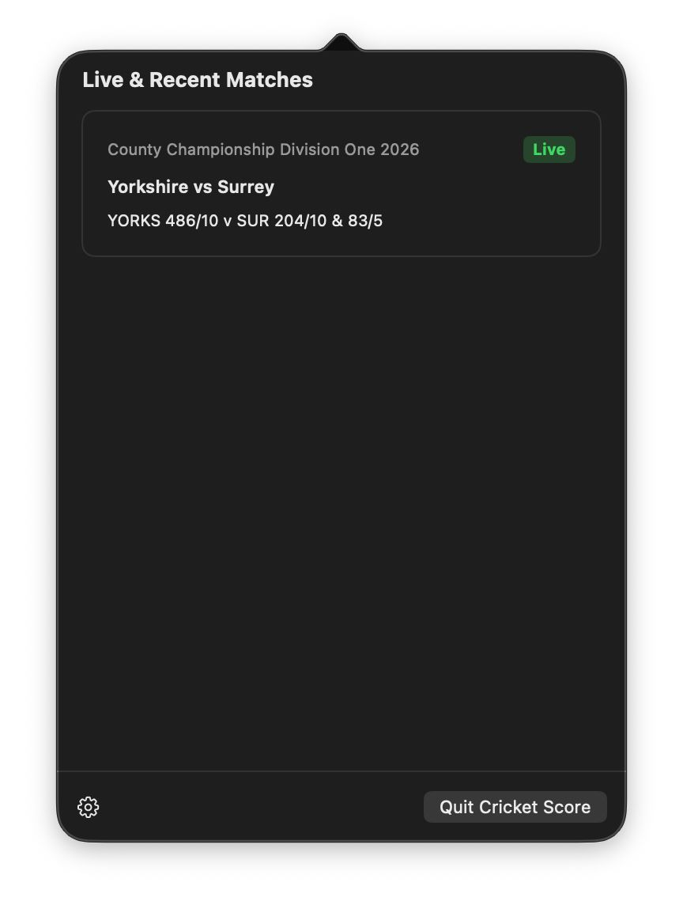
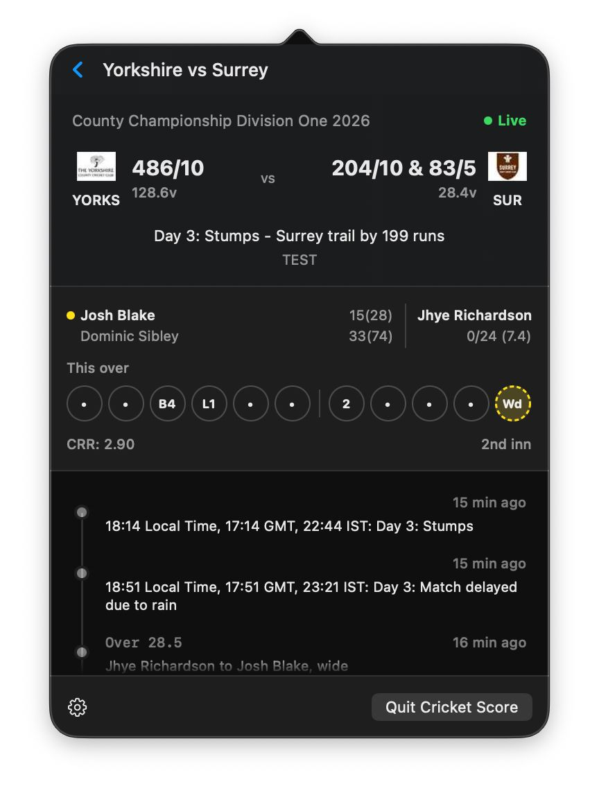

# 🏏 Cricket Menu Bar

A lightweight, high-performance macOS menu bar application that provides real-time cricket scores and event updates. Designed for fans who want to stay updated without interrupting their workflow.

## 📸 Screenshots

| Match Selection | Live Activity Timeline |
| :---: | :---: |
|  |  |

## ✨ Features

- **Glanceable Status Bar Score**: Real-time score (e.g., `IND 184/4 (17.2)`) displayed directly in your macOS menu bar.
- **Rich Activity Timeline**: A frosted-glass (Liquid UI) popover containing a scrollable feed of recent match activities (wickets, boundaries, milestones).
- **Smart Notifications**: Instant system-level alerts for critical events like Wickets, 4s, 6s, and Milestones.
- **AI-Driven Activity Extraction**: Uses Gemini AI to parse raw commentary and extract structured match events.
- **Firebase Authentication**: Secure Google Sign-In integration for personalized features.
- **Customizable Settings**: Configure polling intervals and toggle specific notification types.
- **Background Polling**: Continuous background service ensures you never miss a ball.

## 🛠 Tech Stack

- **Language**: Swift 6.0 (Strict Concurrency)
- **Frameworks**: 
    - **AppKit**: For `NSStatusItem` and application lifecycle.
    - **SwiftUI**: For the rich, modern UI inside the Popover and Settings.
    - **Firebase**: Authentication (Google Sign-In).
    - **UserNotifications**: For system-wide alerts.
- **Data Sources**: 
    - **RapidAPI (Cricbuzz)**: Live match scores and commentary.
    - **Google Generative AI (Gemini)**: AI extraction logic.
- **Build System**: Swift Package Manager (SPM).

## 🚀 Getting Started

### Prerequisites

- **Xcode 15.0+**
- **macOS 14.0+**
- **RapidAPI Key**: Subscribe to the Cricbuzz API on RapidAPI.
- **Firebase Project**: Setup a Firebase project with Google Auth enabled and download the `GoogleService-Info.plist`.

### Installation & Setup

1. **Clone the repository**:
   ```bash
   git clone https://github.com/celeroncoder/cricket-menu-bar.git
   cd cricket-menu-bar
   ```

2. **Configure Environment Variables**:
   Create a `.env` file in the `CricketMenuBar` directory (see `.env.example`):
   ```bash
   RAPIDAPI_KEY=your_key_here
   RAPIDAPI_HOST=cricbuzz-cricket.p.rapidapi.com
   ```

3. **Add Firebase Config**:
   Place your `GoogleService-Info.plist` in `CricketMenuBar/Sources/CricketMenuBar/Resources/`.

4. **Build and Run**:
   Since this is a menu bar app requiring specific entitlements and URL scheme handling for Auth, use the provided bundling script:
   ```bash
   ./CricketMenuBar/scripts/bundle.sh --run
   ```
   *This script handles Swift compilation, app bundling, Info.plist generation, and ad-hoc codesigning.*

## 📂 Project Structure

- `CricketMenuBar/`: Main Swift project.
    - `Sources/`: App source code, UI, and Networking.
    - `Resources/`: Configuration and assets.
    - `scripts/`: Build and bundling utilities.
- `scripts/`: Auxiliary scripts (e.g., AI activity generation test script).
- `mock_data.json`: Sample data for UI development and testing.

## 🤝 Contributing

Contributions are welcome! Please feel free to submit a Pull Request.

## 📄 License

This project is licensed under the MIT License - see the LICENSE file for details.
